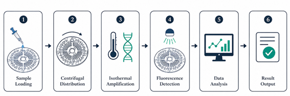
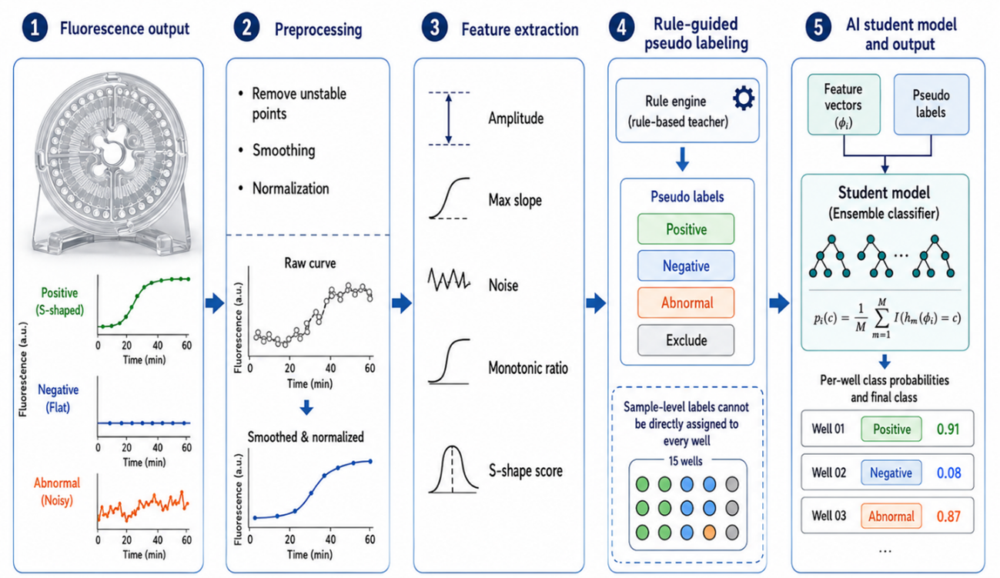
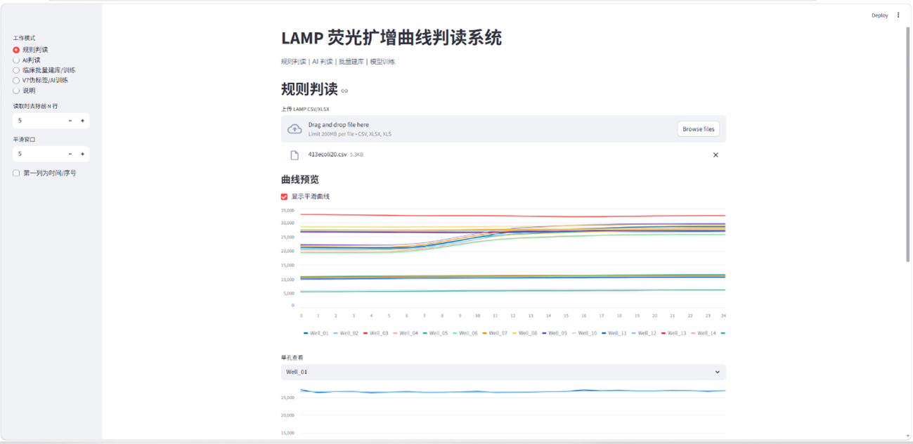
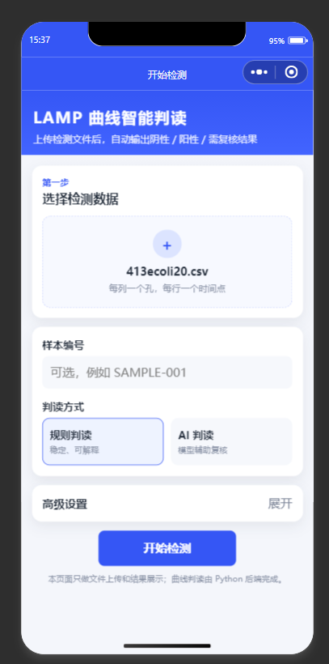
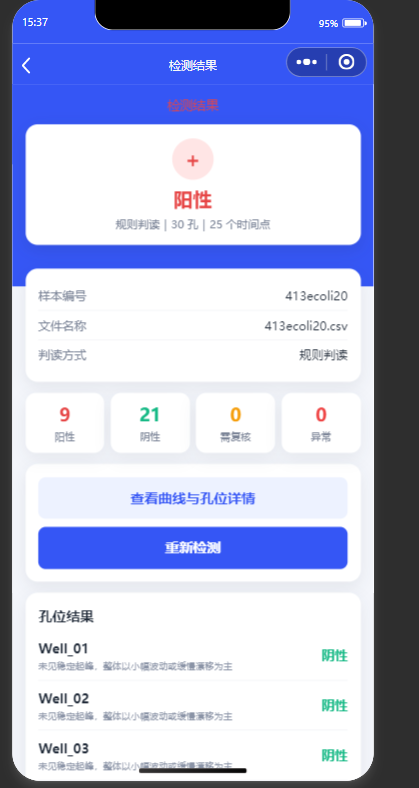

# LAMP Curve AI

面向 LAMP 荧光扩增曲线的智能判读系统，支持规则判读、AI 辅助判读、临床批量建库与微信小程序端展示。项目以扩增曲线形态特征为核心输入，对每个反应孔输出 **阳性 / 阴性 / 异常 / 需复核** 等判读结果，并提供孔位级概率结果作为辅助参考。

> 当前版本包含 PC 端 Streamlit 页面、Python/FastAPI 后端和微信小程序前端。规则判读与 AI 判读分开展示，AI 输出作为辅助证据，不替代规则判读和人工复核。

## 功能概览

- **单文件曲线判读**：上传 CSV / XLSX 文件，自动读取各孔位扩增曲线并输出判读结果。
- **规则判读模块**：根据曲线增幅、最大斜率、单调上升比例、噪声水平和 S 型特征评分进行可解释判读。
- **AI 辅助判读模块**：基于规则教师生成的高置信伪标签训练孔位级 AI 模型，输出每个孔位的类别概率。
- **临床批量建库**：根据临床数据目录和结果汇总表自动匹配样本、拆分孔位并提取曲线特征。
- **移动端展示**：提供微信小程序前端，支持上传文件、查看总结果、孔位列表和单孔曲线详情。

## 方法简介

输入文件中，每一列对应一个反应孔位，每一行对应一个采集时间点。系统读取曲线后会去除前 5 个不稳定采样点，并进行平滑处理。

规则判读主要关注以下曲线形态：

1. 末端荧光相对基线是否明显升高；
2. 曲线是否存在连续上升阶段；
3. 上升过程是否具有较好的单调性；
4. 是否存在尖峰、跳变或强噪声；
5. 是否接近典型 LAMP 阳性扩增的 S 型曲线形态。

AI 模块采用“规则教师—AI 学生”的弱监督思路。由于临床数据通常只有样本级结果，不能直接把样本标签赋给每一个孔位，因此系统先用规则模块筛选高置信孔位，再训练 AI 学生模型学习典型曲线形态。AI 模型输入为扩增曲线形态特征，输出孔位属于不同类别的概率。



## 项目结构

```text
.
├── lamp_curve_ai_v7/              # PC 端与完整 Python 判读流程
│   ├── app_streamlit.py           # Streamlit 前端入口
│   ├── build_clinical_dataset.py  # 临床批量建库
│   ├── build_v7_pseudo_labels.py  # 构建 V7 伪标签
│   ├── train_v7_well_ai.py        # 训练孔位级 AI 模型
│   ├── predict_v7_well_ai.py      # 单文件 AI 预测
│   ├── src/lamp_ai/               # 核心算法模块
│   ├── models/                    # 训练好的模型文件
│   └── examples/                  # 示例输入文件
│
├── lamp_mobile_miniprogram/       # 微信小程序版本
│   ├── backend/                   # FastAPI 后端
│   ├── miniprogram/               # 微信小程序前端
│   ├── src/lamp_ai/               # 复用的判读核心逻辑
│   ├── models/                    # AI 模型文件
│   └── examples/                  # 示例数据
│
├── traildata/                     # 本地测试或训练数据目录
└── README.md
```

> 如果 `traildata/` 中包含真实临床数据，建议不要公开上传到 GitHub。可以在 `.gitignore` 中忽略该目录，只保留脱敏示例数据。

## 快速开始：PC 端 Streamlit

进入 PC 端项目目录：

```bash
cd lamp_curve_ai_v7
```

安装依赖：

```bash
python -m pip install -r requirements.txt
```

启动页面：

```bash
streamlit run app_streamlit.py
```

启动后浏览器会打开本地页面，通常地址为：

```text
http://localhost:8501
```

在页面中上传 CSV / XLSX 曲线文件，即可查看规则判读、AI 判读和曲线预览结果。

## 快速开始：微信小程序版

进入小程序项目目录：

```bash
cd lamp_mobile_miniprogram
```

安装后端依赖：

```bash
python -m pip install -r backend/requirements.txt
```

启动 FastAPI 后端：

```bash
python -m uvicorn backend.main:app --host 0.0.0.0 --port 8000 --reload
```

也可以在 Windows 下直接运行：

```text
run_backend.bat
```

后端启动后，打开浏览器访问：

```text
http://127.0.0.1:8000/api/health
```

如果返回 `ok: true`，说明后端已经正常运行。

然后用微信开发者工具导入：

```text
lamp_mobile_miniprogram/miniprogram
```

小程序默认后端地址配置在：

```text
lamp_mobile_miniprogram/miniprogram/utils/config.js
```

本机调试时可以使用：

```js
const BASE_URL = 'http://127.0.0.1:8000'
```

真机预览时，`127.0.0.1` 指的是手机本机，不是电脑。需要改成电脑的局域网 IP，例如：

```js
const BASE_URL = 'http://192.168.1.23:8000'
```

手机和电脑需要连接同一个 WiFi。

## 输入数据格式

支持 CSV、XLSX 和 XLS 文件。推荐格式如下：

```text
time,A1,A2,A3,A4,...
0,120,118,119,121,...
1,121,118,120,122,...
2,122,119,121,123,...
...
```

也可以不包含 `time` 列，系统会将每一列按反应孔位读取。

基本约定：

- 每一列对应一个反应孔位；
- 每一行对应一个采集时间点；
- 第一列如果是时间或序号，可在前端中开启对应设置；
- 系统默认去除前 5 行不稳定采样点；
- 输出结果包括孔位级判读类别、曲线特征和 AI 概率。

## V7 训练流程

如果需要重新从临床数据构建伪标签并训练 AI 模型，可参考以下流程。

### 1. 临床批量建库

```bash
python build_clinical_dataset.py \
  --root "../medicaldata" \
  --summary "../medicaldata/结果汇总表.xlsx" \
  --out_dir outputs/clinical_v7 \
  --label_mode binary \
  --sample_id_mode two_per_file \
  --sample_layout two_per_file_15x2 \
  --batch_start_override "结果1-1600=1;结果3857-5444=1601" \
  --numeric_parent_only
```

主要输出：

```text
outputs/clinical_v7/clinical_sample_features.csv
outputs/clinical_v7/clinical_well_rule_results.csv
outputs/clinical_v7/clinical_build_report.json
```

### 2. 构建 V7 伪标签

```bash
python build_v7_pseudo_labels.py \
  --well_results outputs/clinical_v7/clinical_well_rule_results.csv \
  --out_dir outputs/clinical_v7/v7_ai
```

主要输出：

```text
outputs/clinical_v7/v7_ai/v7_well_pseudo_labels.csv
outputs/clinical_v7/v7_ai/v7_pseudo_summary.json
```

### 3. 训练孔位级 AI 模型

```bash
python train_v7_well_ai.py \
  --pseudo outputs/clinical_v7/v7_ai/v7_well_pseudo_labels.csv \
  --model models/lamp_v7_well_ai.joblib \
  --metrics outputs/clinical_v7/v7_ai/v7_well_ai_metrics.json \
  --scores outputs/clinical_v7/v7_ai/v7_well_ai_scores.csv
```

### 4. 单文件 AI 预测

```bash
python predict_v7_well_ai.py \
  --input examples/314pc.csv \
  --model models/lamp_v7_well_ai.joblib \
  --out outputs/v7_ai_predictions_314pc.csv
```

## 结果说明

系统输出的主要类别包括：

| 类别 | 含义 |
|---|---|
| 阳性 | 曲线具有明显扩增上升和较典型 S 型形态 |
| 阴性 | 曲线整体平稳，无明显扩增信号 |
| 异常 | 曲线存在尖峰、跳变、强噪声等异常情况 |
| 需复核 | 曲线特征不够典型，建议结合实验背景人工复核 |

需要注意的是，AI 模型的训练指标是相对于规则教师生成的高置信伪标签计算的，不能直接等同于真实临床诊断准确率。实际使用时建议优先参考规则判读和人工复核，AI 概率作为辅助判断依据。

## 界面截图







## 数据与隐私提醒

本项目可能涉及临床样本曲线数据。公开仓库中建议只保留示例数据，不上传原始临床数据、患者信息或未脱敏汇总表。
